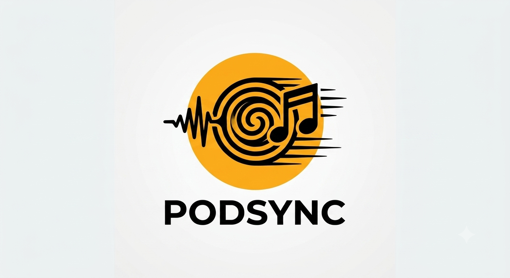
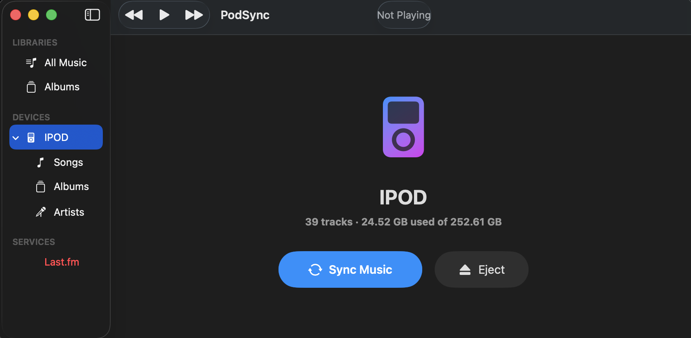
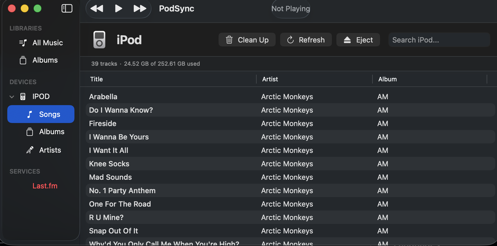
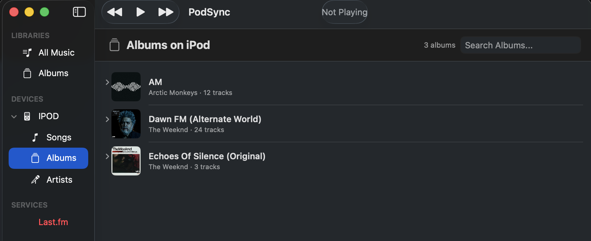
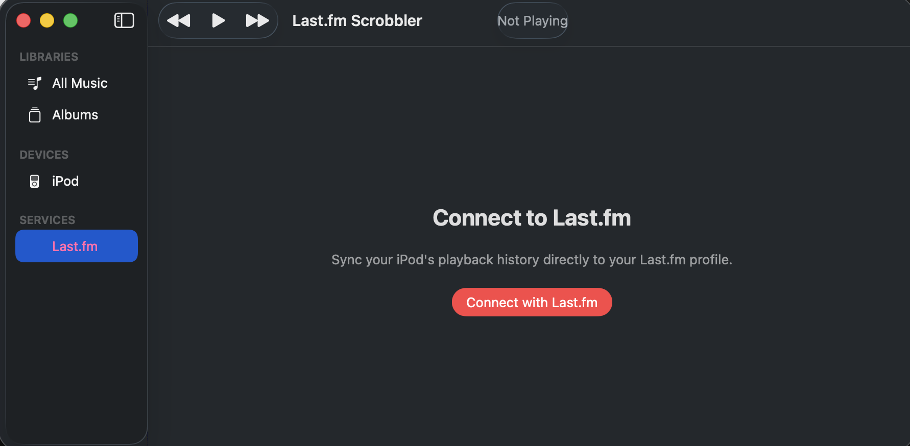
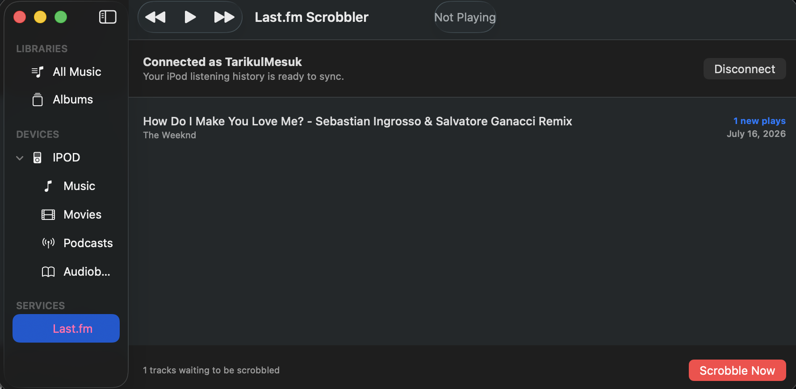

<div align="center">
  
  <h1>PodSync</h1>
  <p>A free, open-source macOS application to sync your modern music library to classic iPods.</p>
</div>

## Why PodSync?

There are some fantastic tools out there for managing classic iPods—like Podcenter—that offer excellent functionality. However, many of these solutions are paid. 

I created PodSync because I believe that keeping classic hardware alive shouldn't have to cost money. PodSync provides a modern, native macOS experience for syncing your music and scrobbling your iPod listens to Last.fm—completely free and open source. Syncing your iPod is dead simple.

## Features
- ✨ **True Drag-and-Drop Syncing:** Forget about confusing menus! Just grab a folder of music from your Mac, drag it directly into the iPod's library inside PodSync, and watch it sync instantly.
- 🎵 **FLAC to MP3/AAC Conversion:** iPods don't natively play FLAC files. PodSync automatically detects FLAC files when you drop them and beautifully converts them into high-quality, iPod-compatible formats (MP3/AAC) with full metadata preservation, so your iPod can play them right out of the gate!
- **Native macOS Interface:** Built entirely with SwiftUI for a seamless, modern macOS experience.
- **Duplicate Detection:** Smartly detects if songs are already on your device before syncing.
- **Last.fm Integration:** Automatically extracts your play history from the iPod and scrobbles it to Last.fm.
- **Open Source:** Free to use, inspect, and modify forever.

## Screenshots
<p align="center">
  
  
  
  
  
</p>

## Requirements
- macOS 13.0 or later
- A classic iPod (e.g., iPod Classic, iPod Nano)

*(Tested and verified working on a MacBook Air M2 2023 and an iPod Classic 7th Gen)*

## Installation

1. Go to the [Releases page](https://github.com/owen-tariq/PodSync/releases) and download the latest `PodSync.dmg`.
2. Open the `.dmg` file and drag **PodSync** into your `Applications` folder.

### Bypassing the "Apple could not verify" Warning
Because PodSync is a free and open-source application, it does not use a paid Apple Developer certificate. When you launch it for the first time, macOS Gatekeeper may show a warning that says:
> *"Apple could not verify “PodSync.app” is free of malware..."*

**To fix this and open the app:**
Open your **Terminal** app and run the following command to remove the quarantine flag:

```bash
xattr -cr /Applications/PodSync.app
```

After running this command, you can open PodSync normally from your Applications folder.

## License
This project is open-source and free to use.
