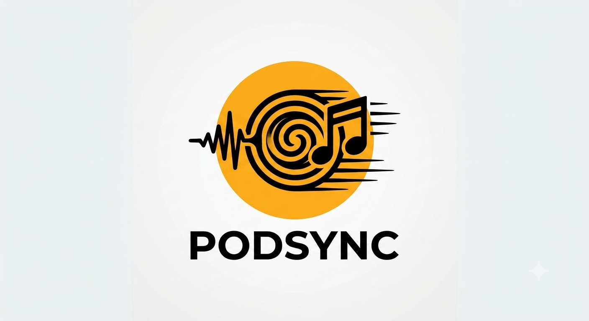
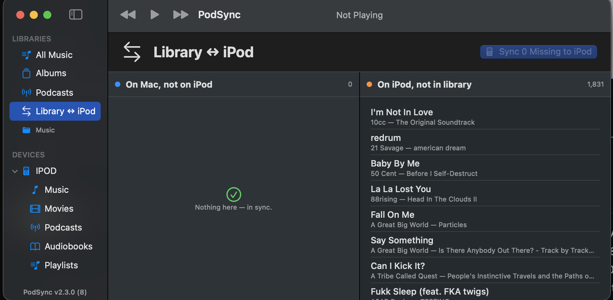
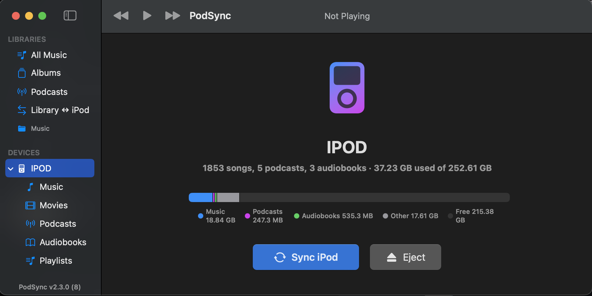
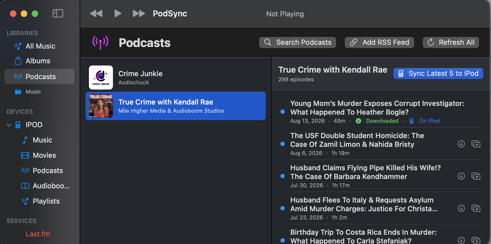
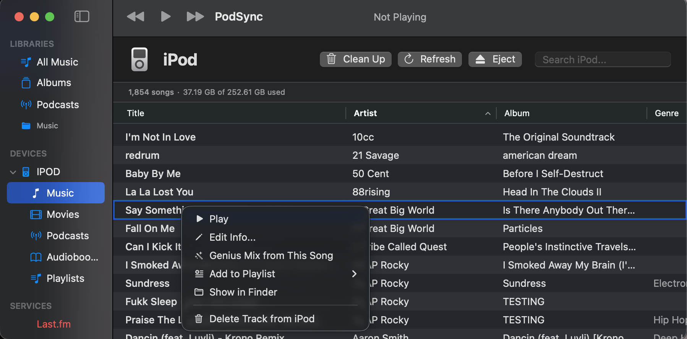
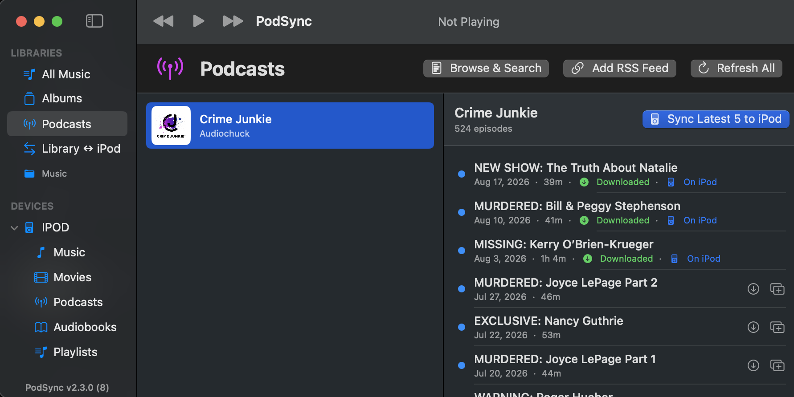
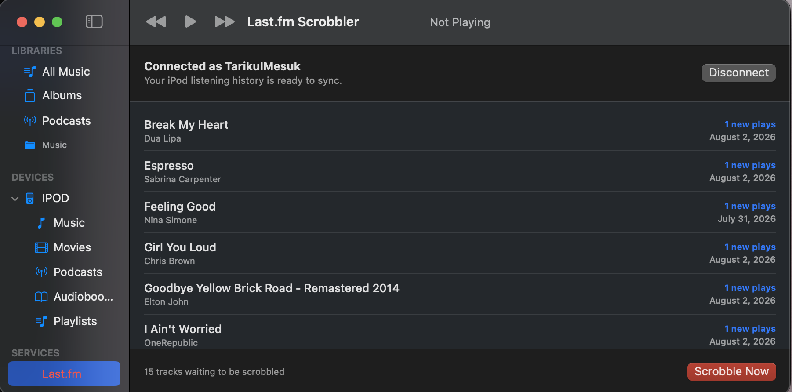
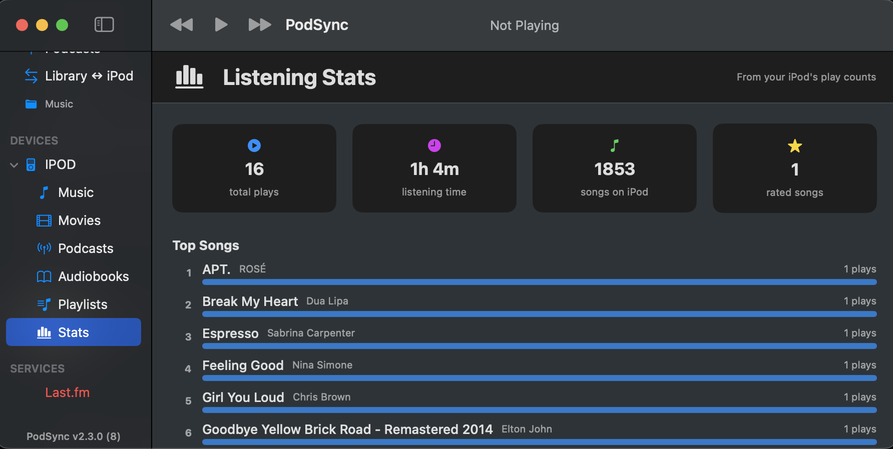

<div align="center">
  
  <h1>PodSync</h1>
  <p>A native macOS application for managing classic iPods without iTunes.</p>
</div>

**Website: [owen-tariq.github.io/PodSync](https://owen-tariq.github.io/PodSync/)** · [Download](https://github.com/owen-tariq/PodSync/releases/latest)

PodSync syncs music, podcasts, audiobooks, and video to click-wheel iPods (Classic, Nano, Mini) over USB. It writes the iPod's own database directly via libgpod, so everything appears in the device's native menus. It is free and open source.

## Features

**Syncing**
- Drag-and-drop syncing of files or folders directly onto the device
- Sync plan review before writing: see what will be added, converted, or skipped as a duplicate
- Duplicate detection against the device library
- Correct media-type routing: music, movies, podcasts, and audiobooks land in their proper iPod menus
- Library folders persist across launches and rescan automatically

**Audio conversion**
- FLAC, WAV, and AIFF convert to AAC using the system encoder; no additional software required
- With [ffmpeg](https://formulae.brew.sh/formula/ffmpeg) installed, OGG, Opus, and WMA input and MP3 output are also supported
- Selectable bitrate (320 / 256 / 128 kbps), configurable per sync or in Settings

**Podcasts**
- Search the podcast directory or subscribe to any RSS feed
- Browse, download, and sync episodes into the iPod's Podcasts menu with correct dates, descriptions, and unplayed indicators
- Per-show retention: keep only the latest N episodes on the device; older ones are removed on sync

**Playlists**
- Create, rename, and delete standard playlists; add tracks from the library view or a picker
- Smart playlists built from rules (artist, album, genre, year, rating, play count) with match-all/any logic, limits, and sorting
- Auto mixes generated locally from listening history — play counts and ratings read back from the device: daily genre mixes, least-played rediscovery, most-played rotation, recently added, older favorites, top songs, decade mixes, and per-artist mixes
- A similarity-based mix can be generated from any song (artist, genre, album, era, and rating weighting)

**Maintenance tools**
- Fix All Missing Artwork: batch cover lookup and write for every album that has none
- Duplicate finder: detects same-song copies and removes the worse one (keeps highest bitrate)
- Library ↔ iPod diff: see what is on the Mac but not the device (and vice versa) and sync the gap in one click
- Playlist backup and restore: playlists, smart playlists, and ratings exported to a JSON file and rebuilt on any iPod
- Filenames like "Artist - Title" or "03 - Title" fill in missing tags automatically during sync

**Insights**
- Storage bar in the device overview: music, podcasts, audiobooks, video, other, and free space at a glance
- Listening stats: total plays, listening time, and ranked top songs, artists, and genres from the device's own play counts
- Menu bar item with device status and quick actions (refresh mixes, sync podcasts, eject)

**Library management**
- Edit title, artist, album, album artist, genre, composer, year, track number, rating, and artwork on device tracks, including batch edits across a selection
- Cover-art lookup for tracks missing artwork
- Artwork is downscaled to a configurable size (300 / 600 / 1000 px or original) before it is written to the device
- Sortable columns and search across title, artist, album, and genre

**Other**
- Last.fm scrobbling of play history extracted from the device
- Native SwiftUI interface
- Preferences window (⌘,) for conversion, sync, artwork, and podcast defaults

## Screenshots

<p align="center">
  
  
  
  
  
  
  
</p>

## Requirements

- macOS 13.0 or later
- A classic click-wheel iPod (tested on iPod Classic 7th generation)
- Optional: ffmpeg, for OGG/Opus/WMA input and MP3 output

## Installation

1. Download `PodSync.dmg` from the [latest release](https://github.com/owen-tariq/PodSync/releases/latest).
2. Open the DMG and drag PodSync into Applications.
3. Because the app is not signed with a paid Apple Developer certificate, clear the quarantine flag before first launch:

```sh
xattr -cr /Applications/PodSync.app
```

## Building from source

```sh
git clone https://github.com/owen-tariq/PodSync.git
cd PodSync
bash build_app.sh
```

The script produces `PodSync.app` in the repository root. CI builds, tests, and packages a DMG on every push; see `.github/workflows/build.yml`.

## Notes

- The bundled `LibGPod.framework` is a prebuilt libgpod for Apple Silicon.
- Podcast search and artwork lookup use the iTunes Search API; podcast downloads come directly from each show's RSS feed.
- Auto mixes are computed entirely on-device from the iPod's play counts and ratings. No account or cloud service is involved.

## License

Open source and free to use.
